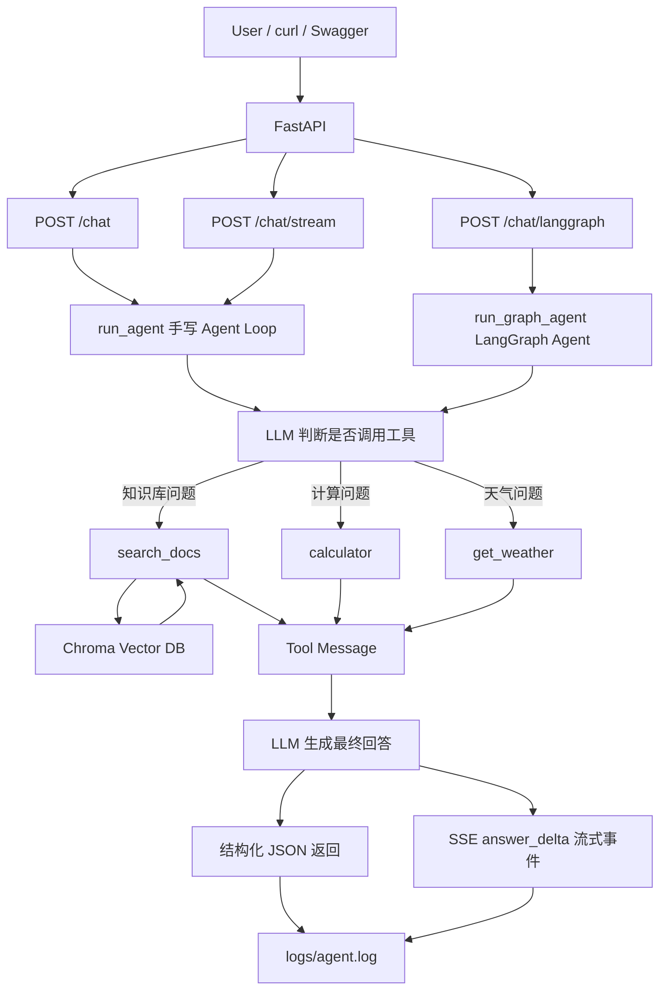

# Enterprise RAG Agent

一个基于 **RAG + Function Calling + LangGraph + FastAPI** 的企业知识库多工具 Agent 项目。

本项目从零实现了一个可调用本地知识库、计算器和天气工具的 Agent，并补充了结构化返回、工具调用记录、RAG 来源追踪、Agent Trace、Metrics 日志分析、MySQL 会话与 Trace 持久化、Feedback 数据飞轮 baseline、API Key 鉴权、请求限流、`search_docs` 检索缓存、真实 B2B 业务知识库、chunk-level 检索评估、MRR@3 排序指标、答案关键点质量评估、Citation Faithfulness、按 category 分组评估、SSE 流式输出、keyword / CrossEncoder reranker 对比实验和 FastAPI 服务化能力。

当前提供三类 Agent API：

| 接口 | 实现方式 | 特点 |
|---|---|---|
| `POST /chat` | 手写 Agent Loop | 流程透明，便于调试和观测工具调用链路 |
| `POST /chat/stream` | 手写 Agent Loop + SSE | 返回 `metadata` / `answer_delta` / `done` / `error` 流式事件 |
| `POST /chat/langgraph` | LangGraph Agent | 支持 checkpoint、session_id 有状态会话、多会话隔离、quality_check 质检 |

同时提供数据飞轮接口：

| 接口 | 用途 |
|---|---|
| `POST /feedback` | 针对某次 `trace_id` 提交 up/down 和 comment，沉淀 bad case |

> 项目定位：面向企业知识库问答场景的 RAG Agent 后端服务原型。

---

## 1. 项目简介

传统 RAG 通常是固定流程：

```text
用户问题 → 检索知识库 → LLM 生成回答
```

本项目将 RAG 检索能力封装成 Agent 工具，让模型根据用户问题自动决定是否需要调用工具：

```text
用户问题
  ↓
LLM 判断是否需要工具
  ↓
search_docs / calculator / get_weather
  ↓
工具结果返回给 LLM
  ↓
生成最终回答
```

当前支持的工具：

| 工具名 | 功能 |
|---|---|
| `search_docs` | 检索本地知识库 |
| `calculator` | 执行基础数学运算 |
| `get_weather` | 查询模拟天气 |

---

## 2. 技术栈

| 模块 | 技术 |
|---|---|
| LLM 调用 | LangChain `ChatOpenAI` |
| 模型 API | DeepSeek OpenAI-compatible API |
| Embedding | `BAAI/bge-m3` |
| Reranker 实验 | keyword baseline / `BAAI/bge-reranker-base` CrossEncoder |
| 向量数据库 | Chroma |
| 文档切分 | `RecursiveCharacterTextSplitter` |
| Agent 实现 | 手写 Function Calling Agent Loop |
| LangGraph Agent | StateGraph / checkpoint / thread_id |
| 工具定义 | JSON Schema / Tool Calling |
| API 服务 | FastAPI |
| 请求校验 | Pydantic |
| 接口鉴权 | `X-API-Key` / FastAPI `Depends` / `APP_API_KEY` 环境变量 |
| 请求限流 | In-memory sliding window / `RATE_LIMIT_WINDOW_SECONDS` / `RATE_LIMIT_MAX_REQUESTS` / `429 Too Many Requests` |
| RAG 检索缓存 | In-memory retrieval cache / `ENABLE_SEARCH_DOCS_CACHE` / `SEARCH_DOCS_CACHE_TTL_SECONDS` / `cache_hit` |
| 流式输出 | FastAPI `StreamingResponse` / SSE |
| Prompt 管理 | `prompts.py` / Prompt V1-V2 对比实验 |
| 日志与 Trace | JSONL / trace_id / duration_ms / model_calls / tool_calls |
| 数据持久化 | MySQL / PyMySQL / session / message / trace / tool call tables |
| Feedback 数据飞轮 | `POST /feedback` / `feedback_logs` / `eval/query_feedback.py` |
| Metrics 分析 | `eval/analyze_logs.py` / `eval/query_db_traces.py` / `eval/query_feedback.py` |
| 评估 | 自定义 eval 脚本 / category 分组指标 / Recall@k / MRR@3 / Answer Point Hit Rate / Citation Faithfulness / rerank mode 差异分析 |

---

## 3. 系统架构



---

## 4. 核心功能

### 4.1 本地知识库 RAG

- 支持读取 `docs/` 目录下的 `.md` / `.txt` 文件
- 使用 `RecursiveCharacterTextSplitter` 切分文档
- 使用 `BAAI/bge-m3` 生成 embedding
- 使用 Chroma 存储和检索向量
- 为每个 chunk 写入 `source`、`chunk_id`、`chunk_index` metadata
- 检索结果返回 `source`、`chunk_id`、`chunk_index`、`content`

### 4.1.1 两阶段检索与 reranker baseline

`search_docs` 当前采用两阶段检索：

```text
用户 query
  ↓
Chroma 向量召回 top candidate_k
  ↓
根据 RERANK_MODE 选择 keyword 或 CrossEncoder rerank
  ↓
返回重排后的 top k chunk
```

实现方式：

- 第一阶段：用 Chroma `similarity_search` 多召回候选，`candidate_k = max(k * 3, 5)`。
- 第二阶段支持两种 rerank mode：
  - `keyword`：轻量规则 baseline，对 query 和 chunk 做词项匹配打分，速度快、可解释。
  - `cross_encoder`：使用 `BAAI/bge-reranker-base` 对 query-chunk pair 做相关性打分，更接近正式 RAG reranker。
- 中文 query 会被拆成 2 字符窗口，英文 / 数字按词保留。
- 返回结果中包含 `rerank_score` 和 `rerank_mode`，方便观察重排是否生效。

当前默认使用 `keyword`，因为它在当前小规模技术知识库上更快、更稳定；`cross_encoder` 作为可选实验模式保留。早期评估中，加入 keyword rerank baseline 后，Chunk Recall@3 曾从 **85.19%** 提升到 **96.30%**；后续项目继续扩展了 hard case、MRR@3、答案关键点评估和 rerank mode 差异分析。

### 4.1.2 `search_docs` 检索缓存 baseline

项目为 RAG 检索工具 `search_docs` 增加了最小可用的内存缓存，用于减少重复 query 带来的 embedding、Chroma 检索和 rerank 开销。

当前缓存流程：

```text
用户 query
  ↓
构造 cache key
  ↓
检查 SEARCH_DOCS_CACHE
  ↓
缓存命中：直接返回缓存中的 chunks，并标记 cache_hit=True
缓存未命中：执行 Chroma 检索 + rerank，写入缓存，并标记 cache_hit=False
```

缓存配置来自环境变量：

```env
ENABLE_SEARCH_DOCS_CACHE=true
SEARCH_DOCS_CACHE_TTL_SECONDS=300
```

cache key 会包含影响检索结果的关键参数，避免错误复用缓存：

```text
query
k
USE_QUERY_REWRITE
USE_RERANK
RERANK_MODE
```

`search_docs` 返回的每个 chunk 会包含：

```json
{
  "cache_hit": true
}
```

同时，`/chat` 和 `/chat/langgraph` 的 `tool_calls` 顶层也会记录：

```json
{
  "name": "search_docs",
  "cache_hit": true
}
```

`eval/analyze_logs.py` 已支持统计 `Search Docs Cache Hit Count`、`Miss Count`、`Unknown Count` 和 `Hit Rate`，用于观察缓存策略是否真的生效。

> 当前实现是单进程内存版 retrieval cache，适合本地项目和服务原型；生产环境中通常会升级为 Redis 分布式缓存，并把知识库版本、租户 ID、权限过滤条件等加入 cache key，避免缓存污染。

### 4.1.3 真实 B2B 业务知识库扩展

项目已从早期技术文档知识库扩展为更贴近企业业务场景的 B2B 知识库，在 `docs/` 中新增商家运营、供应商入驻、商品发布、询盘转化、流量增长、客服售后、经营诊断、知识库治理和 AI 解决方案交付等业务文档。

新增业务文档包括：

```text
docs/b2b_merchant_operation.md
docs/b2b_supplier_onboarding.md
docs/b2b_product_listing_rules.md
docs/b2b_inquiry_conversion.md
docs/b2b_store_traffic_growth.md
docs/b2b_customer_service_after_sales.md
docs/b2b_data_metrics_diagnosis.md
docs/b2b_ai_assistant_scenarios.md
docs/b2b_knowledge_base_governance.md
docs/b2b_solution_delivery.md
docs/b2b_faq.txt
```

这些文档用于模拟 B2B 平台里的商家运营、供应商管理、商品信息质量、售后纠纷、经营诊断和 AI 解决方案交付等真实业务问答场景。重建 Chroma 后，`search_docs` 可以检索到 `b2b_` 业务文档，并通过 `eval/questions.json` 中的 B2B 评估题验证检索和答案质量。

当前文档加载器支持 `.md` / `.txt`。企业生产环境中还会接入 PDF、DOCX、Excel、HTML、飞书/Confluence 页面、数据库记录等多种来源；本项目当前先用 Markdown / TXT 保证文档结构清晰、chunk 可控、评估结果可解释，后续可继续扩展多格式 loader。

### 4.2 Function Calling Agent Loop

Agent 主流程：

```text
1. 用户输入问题
2. 模型判断是否需要调用工具
3. 程序执行工具
4. 工具结果写回 messages
5. 模型基于工具结果生成最终回答
```

### 4.2.1 Prompt 版本化与优化实验

项目将 Agent 的 system prompt 从 `agent.py` 和 LangGraph 代码中抽离到统一的 `prompts.py`，避免手写 Agent 和 LangGraph Agent 各维护一份 prompt 导致行为不一致。

当前包含两个 prompt 版本：

| 版本 | 说明 |
|---|---|
| `SYSTEM_PROMPT_V1` | 原始多工具 Agent prompt，包含基础工具调用规则 |
| `SYSTEM_PROMPT_V2` | 优化版 prompt，增强工具调用策略、RAG grounding、工具异常处理、回答格式和参考来源格式 |

评估脚本支持通过参数切换 prompt：

```bash
python eval/run_eval.py --prompt-version v1
python eval/run_eval.py --prompt-version v2
```

也支持一键对比：

```bash
python eval/run_eval.py --compare-prompts
```

本轮 Prompt V1 / V2 对比结果：

```text
Tool Call Pass Rate：100.00% -> 100.00%
Source Hit Rate：100.00% -> 100.00%
Chunk Recall@1：61.39% -> 61.39%
Chunk Recall@3：89.44% -> 86.67%
MRR@3：100.00% -> 100.00%
Answer Point Hit Rate：100.00% -> 100.00%
```

结论：V2 没有破坏工具调用、来源命中、核心排序和答案要点命中，虽然 Recall@3 有小幅波动，但 V2 对 RAG grounding、工具异常和输出格式的约束更明确，因此当前默认使用 `SYSTEM_PROMPT_V2`。

### 4.3 结构化返回

`run_agent()` 返回：

```json
{
  "trace_id": "3498deb0a6b0471f90e92acb855eab38",
  "user_query": "帮我计算 23 乘以 19",
  "answer": "23 乘以 19 的结果是 437。",
  "model_calls": [
    {
      "round": 1,
      "duration_ms": 1280,
      "has_tool_calls": true,
      "tool_call_count": 1
    },
    {
      "round": 2,
      "duration_ms": 960,
      "has_tool_calls": false,
      "tool_call_count": 0
    }
  ],
  "tool_calls": [
    {
      "name": "calculator",
      "args": {
        "operation": "multiply",
        "a": 23,
        "b": 19
      },
      "result": {
        "result": 437
      },
      "duration_ms": 2
    }
  ],
  "sources": [],
  "rounds": 2,
  "duration_ms": 2242,
  "success": true,
  "error": null
}
```

### 4.4 日志记录

每次 Agent 执行结果会追加写入：

```text
logs/agent.log
```

日志格式为 JSONL，便于后续分析和评估。

### 4.4.1 Agent Trace 链路追踪

`/chat` 对应的手写 Agent Loop 已加入基础 Trace 能力，`/chat/langgraph` 也已经补齐了同样的请求级 Trace 并写入统一日志。一次 Agent 请求会生成一个唯一的 `trace_id`，并记录本次请求从模型调用、工具调用到最终回答的关键链路信息。

当前 trace 字段包括：

| 字段 | 含义 |
|---|---|
| `trace_id` | 本次 Agent 请求的唯一追踪 ID |
| `duration_ms` | 本次请求总耗时 |
| `model_calls` | 每一轮模型调用的耗时、是否触发工具调用、工具调用数量 |
| `tool_calls` | 每个工具的名称、参数、结果和工具执行耗时 |
| `sources` | RAG 检索命中的来源文档 |
| `success` | 本次请求是否正常结束 |
| `error` | 如果请求失败，记录失败原因 |

这让项目不仅能“跑起来”，还可以回答：

- 这次请求为什么慢？
- 慢在模型调用还是工具调用？
- 这次 Agent 调用了哪些工具？
- RAG 检索命中了哪些来源？
- 请求是否正常结束？

### 4.4.2 Metrics 日志分析

项目新增日志分析脚本：

```text
eval/analyze_logs.py
```

运行：

```bash
python eval/analyze_logs.py
```

该脚本读取 `logs/agent.log` 中的 JSONL trace，输出基础 Metrics 报告：

- 日志总条数
- 成功请求数 / 失败请求数
- 成功率
- 平均总耗时
- 平均模型调用次数
- 平均工具调用次数
- Agent 类型分布（manual / langgraph / unknown）
- 按 Agent 类型详细统计
- 工具调用排行榜
- `search_docs` 缓存命中次数、未命中次数和命中率
- 慢请求 Top5
- 失败请求 trace_id 列表

这部分用于模拟真实 Agent 应用中的基础可观测能力，方便进行慢请求分析、工具调用行为分析、缓存效果观察和问题定位。

### 4.4.3 MySQL 会话与 Trace 持久化

项目以 `/chat/langgraph` 作为主线 Agent 接口，接入 MySQL 持久化能力，将 LangGraph Agent 的会话、消息、请求 Trace、工具调用记录和用户反馈结构化保存，便于后续查询、回放、问题排查和 bad case 沉淀。

当前设计 5 张核心表：

| 表名 | 作用 |
|---|---|
| `chat_sessions` | 保存会话 ID、Agent 类型、创建时间和更新时间 |
| `chat_messages` | 保存用户消息和助手回答，支持按 `session_id` 回放聊天历史 |
| `agent_traces` | 保存一次 Agent 请求的整体追踪信息，包括 `trace_id`、用户问题、最终回答、sources、model_calls、quality_check、耗时和成功失败状态 |
| `tool_call_logs` | 保存每一次工具调用的名称、参数、结果、耗时、成功失败状态和错误信息 |
| `feedback_logs` | 保存用户对某次回答的 up/down、comment、trace_id 和 session_id |

`/chat/langgraph` 的落库流程：

```text
用户请求 /chat/langgraph
  ↓
run_graph_agent 执行 LangGraph 工作流
  ↓
保存 chat_sessions
  ↓
保存 user / assistant 消息到 chat_messages
  ↓
保存请求级 Trace 到 agent_traces
  ↓
保存每次工具调用到 tool_call_logs
  ↓
返回结构化 JSON
```

`/feedback` 的数据飞轮流程：

```text
用户收到 Agent 回答
  ↓
用户针对 trace_id 提交 up/down/comment
  ↓
保存到 feedback_logs
  ↓
通过 eval/query_feedback.py 查询差评样本
  ↓
根据 trace_id 回看 agent_traces / tool_call_logs / chat_messages
  ↓
判断问题来自文档缺失、检索召回、rerank、Prompt、工具调用还是模型幻觉
  ↓
将典型 bad case 沉淀进 eval/questions.json
```

项目新增数据库查询脚本：

```bash
python eval/query_db_traces.py
```

当前支持：

- 查询最近 10 条 Agent Trace
- 查询慢请求 Top5
- 查询失败请求
- 根据 `trace_id` 查询工具调用明细
- 根据 `session_id` 查询聊天历史

反馈查询脚本：

```bash
python eval/query_feedback.py
```

当前支持：

- 反馈总数
- 点赞数 / 点踩数
- 好评率
- 最近反馈列表
- 最近差评样本 Top10，并关联原始问题和 Agent 回答

这部分让项目从“只写本地 JSONL 日志”升级为“可结构化落库、可查询、可回放、可分析”的 AI 后端服务原型。

### 4.4.4 API Key 鉴权与请求限流

项目为核心聊天接口增加了轻量 API Key 鉴权和请求限流，避免模型接口裸露调用、被恶意刷请求或短时间触发过多模型调用成本。

鉴权方式：

```text
X-API-Key: your_app_api_key_here
```

服务端从 `.env` 中读取：

```env
APP_API_KEY=your_app_api_key_here
RATE_LIMIT_WINDOW_SECONDS=60
RATE_LIMIT_MAX_REQUESTS=20

ENABLE_SEARCH_DOCS_CACHE=true
SEARCH_DOCS_CACHE_TTL_SECONDS=300
```

当前接口保护范围：

| 接口 | 是否需要 API Key | 说明 |
|---|---|---|
| `GET /health` | 否 | 健康检查接口，方便部署平台、监控系统和负载均衡器探活 |
| `POST /chat` | 是 | 手写 Agent Loop，会调用模型和工具 |
| `POST /chat/stream` | 是 | SSE 流式聊天接口，会调用模型和工具 |
| `POST /chat/langgraph` | 是 | LangGraph 主线 Agent，会调用模型、工具和 MySQL 持久化链路 |

如果请求未携带 `X-API-Key` 或 key 不正确，接口返回：

```json
{
  "detail": "Invalid API Key"
}
```

状态码为 `401 Unauthorized`。

如果同一个 API Key 在配置窗口期内请求过多，接口返回：

```json
{
  "detail": "Too Many Requests"
}
```

状态码为 `429 Too Many Requests`。

当前限流策略：

- 维度：按 `X-API-Key` 限流；
- 算法：应用内存版 sliding window；
- 默认配置：每 60 秒最多 20 次请求；
- 保护范围：`/chat`、`/chat/stream`、`/chat/langgraph`；
- `/health` 不鉴权、不限流，保留给部署平台和监控系统探活。

> 当前实现适合个人项目、本地 Demo 和单进程服务原型。生产环境中通常会升级为 Redis 分布式限流、Nginx / API Gateway 限流，或结合用户 ID、IP、租户维度做更细粒度的配额控制。

### 4.5 Agent 与 RAG 评估

项目内置最小评估脚本：

```text
eval/questions.json
eval/run_eval.py
```

评估集中的每条样本包含用户问题、期望调用工具、期望命中的文档来源、期望命中的 chunk，以及最终答案应该覆盖的关键点：

```json
{
  "id": "rag_chunk_001",
  "category": "rag_technical",
  "question": "RAG 中为什么要切分文档？",
  "expected_tools": ["search_docs"],
  "expected_sources": ["langchain_rag.md"],
  "expected_chunk_ids": [
    "langchain_rag.md::chunk_001",
    "langchain_rag.md::chunk_002"
  ],
  "expected_answer_points": [
    {
      "point": "文档切分可以适配模型上下文窗口限制",
      "keywords": ["上下文窗口", "输入长度", "长度有限"]
    }
  ]
}
```

当前评估指标：

1. **Tool Call Pass Rate**
   - 判断 Agent 是否调用了期望工具。
   - 例如知识库问题期望调用 `search_docs`，计算问题期望调用 `calculator`。

2. **Source Hit Rate**
   - 判断 RAG 检索结果是否命中了期望文档来源。

3. **Chunk Recall@1**
   - 判断排在第 1 位的 chunk 是否命中标注的 `expected_chunk_ids`。

4. **Chunk Recall@3**
   - 判断前 3 个 chunk 中覆盖了多少标注相关 chunk。

5. **MRR@3**
   - 判断第一个可接受相关 chunk 在 top3 中排第几。
   - 如果正确 chunk 排第 1，得分为 1；排第 2，得分为 0.5；排第 3，得分为 0.333。

6. **Answer Point Hit Rate**
   - 判断最终回答是否覆盖 `expected_answer_points` 中标注的答案关键点。
   - 当前使用关键词命中作为可解释 baseline，后续可升级为 LLM-as-Judge 或人工抽检。

7. **Citation Faithfulness Rate**
   - 判断答案中已经命中的关键点，是否也能在 `search_docs` 返回的 retrieved chunks 中找到关键词依据。
   - 该指标用于最小化评估“答案是否有检索上下文支撑”，帮助定位潜在幻觉或引用不一致问题。
   - 当前使用关键词匹配作为可解释 baseline，后续可升级为 LLM-as-Judge / NLI / 人工抽检。

8. **Category Metrics**
   - 按 `tool_basic`、`rag_technical`、`b2b_business` 分组输出指标。
   - 用于分别观察基础工具、技术知识库 RAG、B2B 业务知识库 RAG 的表现。

评估集中额外加入了 3 道 hard case，用于验证更复杂的问题：

- 企业知识库 RAG 回答不准确时如何排查和优化；
- `checkpoint`、`thread_id`、`InMemorySaver` 三者关系；
- 为什么 LangGraph Agent 不能只用 `MessagesState`，以及 `tool_calls` / `sources` 为什么需要 reducer。

第 54 步进一步加入 6 道 B2B 业务评估题，并为每道题补充 `expected_sources`、`expected_chunk_ids` 和 `expected_answer_points`，覆盖商家运营、供应商入驻、商品发布、售后纠纷、经营诊断和 AI 解决方案交付。

评估样本目前通过 `category` 区分：

| category | 数量 | 说明 |
|---|---:|---|
| `tool_basic` | 2 | calculator / get_weather 基础工具题 |
| `rag_technical` | 12 | RAG、Chroma、FastAPI、LangGraph 等技术知识库题 |
| `b2b_business` | 6 | B2B 业务知识库题 |

`run_eval.py` 会同时输出整体指标和按 category 分组的指标，方便分别观察技术知识库和业务知识库的检索质量。

当前评估结果示例：

```text
Tool Call Pass Rate：100.00%
Source Hit Rate：100.00%
RAG 评估题数：18
Chunk Recall@1：约 68.70%
Chunk Recall@3：约 92.96%
MRR@3：约 100.00%
Answer Point Hit Rate：100.00%
Citation Faithfulness Rate：100.00%

按 category 分组：
- rag_technical：12 题，Chunk Recall@3 约 89.44%，MRR@3 约 100.00%
- b2b_business：6 题，Chunk Recall@1 约 83.33%，Chunk Recall@3 100.00%，MRR@3 100.00%
```

使用 `python eval/run_eval.py --compare-rerank` 可自动输出 rerank 前后对比：

```text
Chunk Recall@1：64.81% -> 64.81%（+0.00%）
Chunk Recall@3：85.19% -> 96.30%（+11.11%）
```

评估过程中还会打印低 Recall、低 MRR 和低答案质量样本，便于判断问题来自检索召回、排序、Prompt 生成，还是 ground truth 标注偏窄。项目中曾通过低 MRR 样本发现某个未标注 chunk 其实也能回答问题，因此将其补充进 `expected_chunk_ids`，体现了真实 RAG 项目中“评估集需要迭代”的过程。

使用 `python eval/run_eval.py --compare-rerank-modes` 可自动对比 `keyword` 与 `cross_encoder` 两种 rerank mode，并输出逐题差异分析：

```text
Rerank Mode 对比：keyword vs cross_encoder
Chunk Recall@1：61.39% -> 58.61%（-2.78%）
Chunk Recall@3：89.44% -> 78.33%（-11.11%）
MRR@3：100.00% -> 94.44%（-5.56%）
Answer Point Hit Rate：100.00% -> 100.00%（+0.00%）
```

逐题分析发现，CrossEncoder 并不是完全找不到正确 chunk，而是有时会把“语义上泛相关”的概念 chunk 排到前面，挤掉更具体的目标 chunk，导致 Recall@3 和 MRR@3 下降；但最终 Answer Point Hit Rate 仍为 100%，说明当前返回内容仍足够支撑模型答出关键点。因此当前工程决策是：默认保留 `keyword` rerank，`cross_encoder` 作为可选实验模式。

另外，我也做过一个 rule-based query rewrite baseline，但在当前知识库和问题集上，它反而降低了 Recall@k 和 MRR，说明“盲目加扩展词”会引入 query drift。因此这个功能现在默认关闭，只作为一个负向实验记录保留。

---

## 5. 项目结构

```text
.
├── app/
│   └── main.py                  # FastAPI 服务入口
├── docs/                        # 本地知识库文档，包括技术文档和 B2B 业务文档
├── agent_workflows/
│   ├── __init__.py
│   └── langgraph_agent.py       # LangGraph Agent 工作流
├── eval/
│   ├── questions.json           # 评估问题集
│   ├── run_eval.py              # 工具调用、RAG 检索、MRR、答案关键点、Citation Faithfulness、rerank mode 对比评估脚本
│   ├── analyze_logs.py          # 读取 JSONL trace，统计 Metrics 和慢请求
│   ├── query_db_traces.py       # 查询 MySQL 中的 trace、慢请求、失败请求、工具调用和聊天历史
│   └── query_feedback.py        # 查询用户反馈、好评率和差评 bad case
├── examples/                    # 命令行调试和基础示例
│   ├── rag_cli.py
│   ├── langgraph_cli.py
│   ├── function_calling_basic.py
│   ├── function_calling_agent_loop.py
│   └── minimal_langgraph_agent.py
├── logs/
│   └── agent.log                # Agent 执行日志 / trace 日志
├── Dockerfile                   # 容器化部署配置
├── .dockerignore                # Docker 构建忽略文件
├── agent.py                     # 手写 Function Calling Agent Loop
├── database.py                  # MySQL 连接、建表与持久化写入函数
├── config.py                    # 项目配置
├── models.py                    # LLM 和 Embedding 初始化
├── schemas.py                   # 工具 Schema
├── tools.py                     # 工具函数实现
├── vector_store.py              # 文档加载、切分、Chroma 向量库
└── README.md
```

---

## 6. 快速开始

### 6.1 安装依赖

建议使用 Python 3.11。

```bash
python -m venv .venv
source .venv/bin/activate
pip install -r requirements.txt
```

如果你使用 conda，也可以：

```bash
conda create -n rag-agent python=3.11
conda activate rag-agent
pip install -r requirements.txt
```

---

### 6.2 环境变量

在项目根目录创建 `.env`：

```env
DEEPSEEK_API_KEY=你的 API Key
DEEPSEEK_BASE_URL=https://api.deepseek.com
DEEPSEEK_MODEL=deepseek-v4-flash

MYSQL_HOST=127.0.0.1
MYSQL_PORT=3306
MYSQL_USER=root
MYSQL_PASSWORD=your_mysql_password_here
MYSQL_DATABASE=rag_agent
MYSQL_CHARSET=utf8mb4

APP_API_KEY=your_app_api_key_here

RATE_LIMIT_WINDOW_SECONDS=60
RATE_LIMIT_MAX_REQUESTS=20
```

> 注意：不要把真实 API Key、MySQL 密码等敏感信息提交到 GitHub。

---

### 6.3 初始化 MySQL 数据库

本项目的 LangGraph 主线接口 `/chat/langgraph` 支持把会话、消息、Trace 和工具调用记录保存到 MySQL。

先创建数据库：

```sql
CREATE DATABASE rag_agent DEFAULT CHARACTER SET utf8mb4 COLLATE utf8mb4_unicode_ci;
```

然后初始化表结构：

```bash
python database.py
```

初始化后会创建：

```text
chat_sessions
chat_messages
agent_traces
tool_call_logs
feedback_logs
```

---

### 6.4 命令行运行

```bash
python examples/rag_cli.py
```

示例问题：

```text
RAG 是什么？
帮我计算 23 乘以 19
上海今天天气怎么样？
请介绍一下 RAG，并帮我计算 12 加 8
```

---

### 6.5 启动 FastAPI 服务

```bash
uvicorn app.main:app --reload
```

健康检查：

```bash
curl http://127.0.0.1:8000/health
```

返回：

```json
{
  "status": "ok",
  "service": "rag-agent-api"
}
```

---

### 6.6 API Key 鉴权与请求限流说明

除 `/health` 外，核心聊天接口都需要携带 `X-API-Key`：

```text
X-API-Key: your_app_api_key_here
```

如果未携带或 key 错误，会返回 `401 Unauthorized`。

核心聊天接口同时启用了请求限流：

```env
RATE_LIMIT_WINDOW_SECONDS=60
RATE_LIMIT_MAX_REQUESTS=20
```

含义是：同一个 API Key 在 60 秒内最多请求 20 次。超过限制会返回 `429 Too Many Requests`。

当前是单进程内存版限流，适合本地和服务原型；生产环境建议升级到 Redis / API Gateway / Nginx 限流。

`search_docs` 检索工具同时支持最小内存缓存：

```env
ENABLE_SEARCH_DOCS_CACHE=true
SEARCH_DOCS_CACHE_TTL_SECONDS=300
```

含义是：相同 query 和相同检索配置在 300 秒内重复请求时，可以直接复用上一次的检索结果。返回结果和 `tool_calls` 中会带有 `cache_hit` 字段，便于通过日志分析缓存命中率。

当前是单进程内存版 retrieval cache，适合本地和服务原型；生产环境建议升级到 Redis，并将知识库版本、用户权限、租户 ID 等因素纳入 cache key。

---

### 6.7 调用 `/chat`

```bash
curl -X POST http://127.0.0.1:8000/chat \
  -H "Content-Type: application/json" \
  -H "X-API-Key: your_app_api_key_here" \
  -d '{"message": "帮我计算 23 乘以 19"}'
```

FastAPI Swagger 文档：

```text
http://127.0.0.1:8000/docs
```

---

### 6.8 调用 `/chat/stream`

`/chat/stream` 使用 FastAPI `StreamingResponse` 返回 SSE 结构化流式事件。

```bash
curl -N -X POST http://127.0.0.1:8000/chat/stream \
  -H "Content-Type: application/json" \
  -H "X-API-Key: your_app_api_key_here" \
  -d '{"message": "RAG 是什么？"}'
```

说明：

- `-N` 表示关闭 curl 缓冲，方便观察流式输出；
- 当前实现是“应用层 streaming”：先完整执行 Agent，再把最终 answer 分段返回；
- 后续可以升级为真正的模型 token streaming。

输出示例：

```text
data: {"type": "metadata", "trace_id": "...", "sources": ["langchain_rag.md"], "duration_ms": 5300, "success": true}

data: {"type": "answer_delta", "content": "RAG 是 Retrieval-Augmented"}

data: {"type": "answer_delta", "content": " Generation，即检索增强生成..."}

data: {"type": "done", "trace_id": "..."}
```

---

### 6.9 调用 `/chat/langgraph`

`/chat/langgraph` 使用 LangGraph Agent，支持通过 `session_id` 保留多轮对话状态。

第一次请求：

```bash
curl -X POST http://127.0.0.1:8000/chat/langgraph \
  -H "Content-Type: application/json" \
  -H "X-API-Key: your_app_api_key_here" \
  -d '{"message": "我叫小明", "session_id": "user-a"}'
```

第二次请求：

```bash
curl -X POST http://127.0.0.1:8000/chat/langgraph \
  -H "Content-Type: application/json" \
  -H "X-API-Key: your_app_api_key_here" \
  -d '{"message": "我叫什么？", "session_id": "user-a"}'
```

预期：第二次可以回答你叫小明。

会话隔离测试：

```bash
curl -X POST http://127.0.0.1:8000/chat/langgraph \
  -H "Content-Type: application/json" \
  -H "X-API-Key: your_app_api_key_here" \
  -d '{"message": "我叫什么？", "session_id": "user-b"}'
```

预期：`user-b` 不知道 `user-a` 的历史信息。

---

### 6.10 提交 `/feedback`

`/feedback` 用于给某次 Agent 回答提交用户反馈，形成最小数据飞轮。

```bash
curl -X POST http://127.0.0.1:8000/feedback \
  -H "Content-Type: application/json" \
  -H "X-API-Key: your_app_api_key_here" \
  -d '{
    "trace_id": "your_trace_id_here",
    "session_id": "feedback-test-001",
    "rating": "down",
    "comment": "回答没有引用正确文档"
  }'
```

`rating` 当前只支持：

```text
up
down
```

查询反馈统计：

```bash
python eval/query_feedback.py
```

---

### 6.11 运行评估脚本

```bash
python eval/run_eval.py
```

输出示例：

```text
共加载 20 条评估问题
...
评估完成
总题数：20
工具调用通过数 Tool Call Pass Count：20
工具调用通过率 Tool Call Pass Rate：100.00%
来源命中数 Source Hit Count：20
来源命中率 Source Hit Rate：100.00%
RAG 评估题数：18
Chunk Recall@1：约 68.70%
Chunk Recall@3：约 92.96%
MRR@3：约 100.00%
答案质量评估题数：18
Answer Point Hit Rate：100.00%
Citation Faithfulness 评估题数：18
Citation Faithfulness Rate：100.00%

按 category 分组指标：
- tool_basic：2 题，RAG 指标 N/A
- rag_technical：12 题，Chunk Recall@3 约 89.44%
- b2b_business：6 题，Chunk Recall@3 100.00%，MRR@3 100.00%
```

对比 keyword 与 CrossEncoder rerank：

```bash
python eval/run_eval.py --compare-rerank-modes
```

该命令会分别运行 `keyword` 和 `cross_encoder` 两种 rerank mode，并输出整体指标差异、变好样本、变差样本，以及“指标不变但 top3 变化”的样本。

对比 Prompt V1 与 V2：

```bash
python eval/run_eval.py --compare-prompts
```

该命令会分别运行原始 prompt 和优化 prompt，并输出工具调用、来源命中、Recall@k、MRR@3、答案关键点命中率和 Citation Faithfulness 的前后对比。

---

### 6.12 分析 Agent Trace 日志

运行日志分析脚本：

```bash
python eval/analyze_logs.py
```

输出内容包括：

```text
========== Agent 运行报告 ==========
日志总条数：...
成功请求数：...
失败请求数：...
成功率：...
平均总耗时：... ms
平均模型调用次数：...
平均工具调用次数：...

========== Agent 类型分布 ==========
manual: ...
langgraph: ...
unknown: ...

========== 按 Agent 类型统计 ==========
manual: 请求数=...，成功率=...，平均总耗时=... ms，平均模型调用次数=...，平均工具调用次数=...
langgraph: 请求数=...，成功率=...，平均总耗时=... ms，平均模型调用次数=...，平均工具调用次数=...

========== 工具使用情况 ==========
search_docs: ...
calculator: ...

========== Search Docs Cache ==========
Search Docs Cache Hit Count：...
Search Docs Cache Miss Count：...
Search Docs Cache Unknown Count：...
Search Docs Cache Hit Rate：...

========== 慢请求 Top5 ==========
1. trace_id=... duration_ms=... question=...

========== 失败请求 ==========
暂无失败请求
```

该脚本用于把单条 Agent trace 汇总成整体 Metrics，方便分析系统成功率、平均耗时、工具使用分布、`search_docs` 缓存命中率和慢请求。

示例输出（会随日志增长而变化）：

```text
========== Agent 运行报告 ==========
日志总条数：95
成功请求数：2
失败请求数：0
成功率：100.00%
平均总耗时：6475.25 ms
平均模型调用次数：2.00 （统计样本数：2）
平均工具调用次数：1.09 （统计样本数：95）

========== Agent 类型分布 ==========
unknown: 94
langgraph: 1

========== 工具使用情况 ==========
search_docs: 65
calculator: 26
get_weather: 13

========== Search Docs Cache ==========
Search Docs Cache Hit Count：2
Search Docs Cache Miss Count：1
Search Docs Cache Unknown Count：360
Search Docs Cache Hit Rate：66.67%

========== 慢请求 Top5 ==========
1. trace_id=... duration_ms=... question=...

========== 失败请求 ==========
暂无失败请求
```

这里的 `unknown` 主要来自旧日志，因为它们是在引入 `agent_type` 之前生成的。后续新的 `/chat` 请求会记为 `manual`，`/chat/langgraph` 请求会记为 `langgraph`。

---

### 6.13 Docker 容器化启动

如果你本地已经安装并启动 Docker，可以直接用容器方式运行项目：

```bash
docker build -t rag-agent-demo .
docker run --rm -p 8000:8000 --env-file .env rag-agent-demo
```

说明：

- `Dockerfile` 使用 Python 3.11 slim 作为基础镜像；
- `.dockerignore` 会排除 `local_notes/`、`logs/`、`chroma_db/`、`.env` 等本地文件；
- 容器启动后可通过 `http://127.0.0.1:8000/health` 验证服务；
- `/chat` 和 `/chat/langgraph` 也可以正常调用。

---

## 7. API 说明

### `GET /health`

健康检查接口。

响应：

```json
{
  "status": "ok",
  "service": "rag-agent-api"
}
```

---

### 鉴权与限流说明

除 `GET /health` 外，聊天接口和反馈接口都需要请求头：

```text
X-API-Key: your_app_api_key_here
```

未携带或 key 错误会返回 `401 Unauthorized`。

同一个 API Key 在限流窗口内请求过多会返回 `429 Too Many Requests`。

相关配置：

```env
APP_API_KEY=your_app_api_key_here
RATE_LIMIT_WINDOW_SECONDS=60
RATE_LIMIT_MAX_REQUESTS=20
ENABLE_SEARCH_DOCS_CACHE=true
SEARCH_DOCS_CACHE_TTL_SECONDS=300
```

### `POST /chat`

请求：

```json
{
  "message": "RAG 是什么？"
}
```

响应：

```json
{
  "trace_id": "3498deb0a6b0471f90e92acb855eab38",
  "user_query": "RAG 是什么？",
  "answer": "...",
  "model_calls": [
    {
      "round": 1,
      "duration_ms": 1300,
      "has_tool_calls": true,
      "tool_call_count": 1
    },
    {
      "round": 2,
      "duration_ms": 1700,
      "has_tool_calls": false,
      "tool_call_count": 0
    }
  ],
  "tool_calls": [
    {
      "name": "search_docs",
      "args": {
        "query": "RAG 是什么？"
      },
      "result": [
        {
          "source": "rag_notes.md",
          "chunk_id": "rag_notes.md::chunk_001",
          "chunk_index": 1,
          "content": "...",
          "cache_hit": false
        }
      ],
      "duration_ms": 300,
      "cache_hit": false
    }
  ],
  "sources": ["rag_notes.md"],
  "rounds": 2,
  "duration_ms": 3300,
  "success": true,
  "error": null
}
```

错误响应：

空问题：

```json
{
  "detail": "message 不能为空"
}
```

Agent 执行异常：

```json
{
  "detail": "Agent 执行失败：..."
}
```

---

### `POST /chat/stream`

SSE 流式聊天接口。

请求：

```json
{
  "message": "RAG 是什么？"
}
```

响应类型：

```text
Content-Type: text/event-stream
```

事件格式：

```text
data: {"type": "metadata", "trace_id": "...", "sources": ["langchain_rag.md"], "duration_ms": 5300, "success": true}

data: {"type": "answer_delta", "content": "RAG 是 Retrieval-Augmented"}

data: {"type": "answer_delta", "content": " Generation，即检索增强生成..."}

data: {"type": "done", "trace_id": "..."}
```

事件说明：

| 事件类型 | 含义 |
|---|---|
| `metadata` | 返回 `trace_id`、`sources`、`duration_ms`、`success` 等请求元信息 |
| `answer_delta` | 最终答案的分段文本 |
| `error` | 流式输出过程中的错误事件 |
| `done` | 流式输出结束 |

当前实现说明：

- 这是简单版 Streaming：先执行完整 Agent，再把最终 `answer` 分段以 SSE 返回；
- 请求参数错误仍返回 HTTP 400；
- 如果流式生成过程中出错，会返回 `error` 事件并发送 `done` 事件结束。

---

### `POST /chat/langgraph`

LangGraph Agent 聊天接口。

请求：

```json
{
  "message": "我叫什么？",
  "session_id": "user-a"
}
```

字段说明：

| 字段 | 含义 |
|---|---|
| `message` | 用户问题 |
| `session_id` | API 层会话 ID，会映射为 LangGraph 的 `thread_id` |

响应：

```json
{
  "trace_id": "c2b4f8f34f0f4fa5a0c1f2ab3c6d8e77",
  "agent_type": "langgraph",
  "thread_id": "user-a",
  "answer": "你叫小明。",
  "model_calls": [
    {
      "round": 1,
      "duration_ms": 880,
      "has_tool_calls": false,
      "tool_call_count": 0
    }
  ],
  "tool_calls": [],
  "sources": [],
  "messages_count": 4,
  "duration_ms": 900,
  "success": true,
  "error": null
}
```

如果调用工具，响应中会包含 `tool_calls`、`sources` 和对应的 `model_calls`。

错误响应：

```json
{
  "detail": "message 不能为空"
}
```

或：

```json
{
  "detail": "session_id 不能为空"
}
```

---

### `POST /feedback`

提交用户反馈接口。

请求：

```json
{
  "trace_id": "c2b4f8f34f0f4fa5a0c1f2ab3c6d8e77",
  "session_id": "user-a",
  "rating": "down",
  "comment": "回答没有引用正确文档"
}
```

字段说明：

| 字段 | 含义 |
|---|---|
| `trace_id` | 被评价的那次 Agent 请求 ID |
| `session_id` | 可选，会话 ID |
| `rating` | `up` 或 `down` |
| `comment` | 可选，用户文字反馈 |

响应：

```json
{
  "success": true,
  "feedback_id": "50f87b013b064e49a1d39cd52163ae80",
  "trace_id": "c2b4f8f34f0f4fa5a0c1f2ab3c6d8e77",
  "session_id": "user-a",
  "rating": "down"
}
```

错误响应：

```json
{
  "detail": "rating 只能是 up 或 down"
}
```

---

## 8. 项目亮点

### 8.1 RAG 被封装为 Agent 工具

不是固定每次检索，而是让模型根据问题决定是否调用 `search_docs`。

### 8.2 支持多工具调用

例如：

```text
请介绍一下 RAG，并帮我计算 12 加 8
```

Agent 可以同时调用：

```text
search_docs + calculator
```

### 8.3 具备工程化基础

项目不仅能回答问题，还实现了：

- 结构化返回
- 请求级 `trace_id`
- 模型调用耗时记录
- 工具调用耗时记录
- RAG 来源追踪
- 工具异常保护
- 最大轮数限制
- JSONL 日志
- Metrics 日志分析脚本
- 慢请求 Top5 分析
- 自动评估脚本
- FastAPI 服务化
- HTTP 请求校验和错误处理
- SSE 流式输出接口

### 8.4 可评估

通过 `eval/run_eval.py` 自动验证：

- Agent 是否调用了期望工具
- RAG 是否命中了期望文档来源
- top-k 检索结果是否命中了期望 chunk
- 第一个可接受相关 chunk 是否排在前面（MRR@3）
- 最终回答是否覆盖标注的答案关键点
- 答案命中的关键点是否能被 retrieved chunks 支撑（Citation Faithfulness）
- rerank baseline 是否改善检索排序

当前评估指标包括 Tool Call Pass Rate、Source Hit Rate、Chunk Recall@1、Chunk Recall@3、MRR@3、Answer Point Hit Rate 和 Citation Faithfulness Rate，并支持按 `category` 分组输出 `tool_basic`、`rag_technical`、`b2b_business` 指标，避免只靠人工测试。

评估集不仅包含单知识点问题，也包含 hard case，例如 RAG 回答不准确时如何排查、LangGraph checkpoint/thread_id/InMemorySaver 的关系、State/reducer 设计等；同时新增 B2B 业务题，覆盖商家运营、供应商入驻、商品发布、售后和经营诊断。通过低 MRR 样本分析，项目还补充了等价相关 chunk 到 ground truth，体现评估集迭代过程。

同时通过 `eval/analyze_logs.py` 对 Agent 运行日志进行 Metrics 分析，补充运行层面的成功率、平均耗时、工具使用分布和慢请求排查能力。

### 8.5 Feedback 数据飞轮 baseline

项目新增 `POST /feedback` 和 `feedback_logs` 表，将用户对某次回答的 up/down/comment 与 `trace_id` 关联起来。

这使得项目可以形成最小数据飞轮：

```text
Agent 回答
  ↓
用户反馈 up/down/comment
  ↓
根据 trace_id 回看问题、回答、工具调用、sources、cache_hit
  ↓
定位问题来自文档、检索、rerank、Prompt、工具还是模型幻觉
  ↓
把典型 bad case 加入 eval/questions.json
```

`eval/query_feedback.py` 可以统计反馈总数、点赞数、点踩数、好评率，并列出最近差评样本，便于后续优化知识库、Prompt 和评估集。

### 8.6 SSE 流式输出

项目新增：

```text
POST /chat/stream
```

该接口使用 FastAPI `StreamingResponse` 返回 SSE 事件：

```text
metadata -> answer_delta -> done
```

如果流式输出过程中出现异常，会返回：

```text
error -> done
```

当前实现属于“应用层 streaming”：Agent 仍然先完整完成工具调用和最终回答生成，然后把最终 `answer` 分段推送给客户端。这样能先建立真实大模型产品常见的流式接口形态，后续可以升级为模型 token 级 streaming。

### 8.7 LangGraph Quality Check 节点

LangGraph 版本在基础 `model → tools → model` 流程后新增了一个 `quality_check` 节点：

```text
START → model → conditional edge
              ├── tools → model
              └── quality_check → END
```

这个节点用于模拟真实 Agent 工作流里的后处理 / 质检 / 审计步骤。它不额外调用 LLM，而是基于最终状态做规则检查，并把检查结果结构化返回。

当前检查字段：

| 字段 | 含义 |
|---|---|
| `has_answer` | 最终回答是否非空 |
| `answer_length` | 最终回答长度 |
| `has_tool_calls` | 当前会话是否发生过工具调用 |
| `has_search_docs_call` | 是否调用过知识库检索工具 |
| `has_sources` | 是否记录到 RAG 来源 |
| `has_tool_error` | 工具调用结果中是否存在 error |
| `warnings` | 规则检查产生的告警列表 |

示例：

```json
{
  "quality_check": {
    "has_answer": true,
    "answer_length": 128,
    "has_tool_calls": true,
    "has_search_docs_call": true,
    "has_sources": true,
    "has_tool_error": false,
    "warnings": []
  }
}
```

这个节点让 LangGraph 版本不只是手写 Agent Loop 的等价改写，而是体现了图工作流可以继续扩展“生成后质检、人工审核、风险控制、审计记录”等节点。

### 8.8 LangGraph 有状态 Agent 工作流

项目中包含：

```text
agent_workflows/langgraph_agent.py
```

该文件将手写 Agent Loop 抽象为可维护的 LangGraph 工作流：

```text
START → model → conditional edge
              ├── tools → model
              └── quality_check → END
```

并进一步加入：

- `InMemorySaver` checkpoint
- `thread_id` 会话 ID
- 同一 thread_id 的历史记忆
- 不同 thread_id 的会话隔离
- LangGraph Agent 结构化返回
- 自定义 `GraphState`
- 自定义 reducer 累积 `tool_calls` 和 `sources`
- `quality_check` 节点，对最终回答做规则级自检

`quality_check` 节点不调用大模型，而是在最终回答生成后检查：

- 最终回答是否为空
- 回答长度
- 是否发生过工具调用
- 是否调用过 `search_docs`
- 调用 `search_docs` 后是否记录到 sources
- 工具结果中是否存在 error

当前 LangGraph Agent 返回：

```python
{
    "trace_id": "...",
    "agent_type": "langgraph",
    "thread_id": "...",
    "answer": "...",
    "model_calls": [...],
    "tool_calls": [...],
    "sources": [...],
    "quality_check": {
        "has_answer": true,
        "answer_length": 128,
        "has_tool_calls": true,
        "has_search_docs_call": true,
        "has_sources": true,
        "has_tool_error": false,
        "warnings": []
    },
    "messages_count": 6,
    "duration_ms": 900,
    "success": true,
    "error": null
}
```

并且已经通过 FastAPI 暴露为：

```text
POST /chat/langgraph
```

该接口把请求里的 `session_id` 映射为 LangGraph 的 `thread_id`，从而实现：

- 同一个 `session_id` 保留历史上下文
- 不同 `session_id` 之间状态隔离
- 工具调用记录和 RAG 来源可跨轮累积

---

### 8.9 手写 Agent 和 LangGraph Agent 对比

| 能力 | `/chat` 手写 Agent | `/chat/langgraph` LangGraph Agent |
|---|---|---|
| 工具调用 | 支持 | 支持 |
| RAG 来源 | 支持 | 支持 |
| 结构化返回 | 支持 | 支持 |
| 日志 / Trace | 支持 | 支持（trace_id / duration_ms / model_calls / tool_calls） |
| 流程表达 | Python loop / if-else | StateGraph / Node / Edge / quality_check |
| 有状态会话 | 需要手动管理 | checkpoint + thread_id |
| 多会话隔离 | 需要手动实现 | 已支持 |
| 回答质检 | 暂无独立节点 | 规则级 quality_check 节点 |
| 适合用途 | 简洁透明的 Agent 执行链路 | 扩展复杂 Agent 工作流 |

---

## 9. 当前不足

当前项目仍处于工程原型和持续迭代阶段，存在以下不足：

1. 已接入 CrossEncoder reranker baseline，但在当前小规模知识库上未优于 keyword rerank，后续需要在更大文档规模和更复杂 query 上继续验证
2. 评估已覆盖工具调用、source 命中、chunk-level Recall@k、MRR@3、答案关键点命中、Citation Faithfulness baseline、category 分组指标、rerank mode 差异分析和 Prompt V1/V2 对比，但还没有覆盖严格引用一致性、幻觉检测和 LLM-as-Judge
3. 天气工具是模拟数据
4. 核心聊天接口已接入 API Key 鉴权、单进程内存版请求限流和 `search_docs` 内存缓存，但尚未实现用户体系、角色权限、Redis 分布式限流和 Redis 分布式缓存
5. 尚未接入前端
6. Trace 和 Metrics 已支持 JSONL 日志分析与 MySQL 查询脚本，但尚未接入可视化面板、告警或 OpenTelemetry
7. LangGraph 的会话、消息、Trace 和工具调用已接入 MySQL 持久化，但 checkpoint 目前仍是内存级 InMemorySaver，尚未持久化到数据库级 checkpointer
8. Feedback 数据飞轮已支持 up/down/comment 和差评查询，但尚未支持 bad case 自动归因、聚类和人工审核流
9. `/chat/stream` 当前是应用层流式返回，还不是模型 token 级 streaming
10. 尚未接入 vLLM 本地模型部署

---

## 10. 后续优化计划

优先级从高到低：

1. 增加引用一致性、幻觉检测和 LLM-as-Judge 评估
2. 继续扩展 hard case，覆盖更多真实业务问题和多文档综合问题
3. 继续扩展 reranker 实验：调大 candidate_k、扩展真实业务文档、对比更多 reranker 模型
4. 将 Prompt 对比扩展为更多真实业务 case，并继续观察 V2 在复杂问题下的稳定性
5. 将当前内存版 Rate Limit 和 `search_docs` cache 升级为 Redis 分布式限流 / 分布式缓存，并继续增加更细粒度权限控制
6. 给 feedback 差评样本增加问题归因字段，例如 retrieval_miss / rerank_error / document_missing / prompt_issue / hallucination
7. 将 MySQL Trace 查询能力扩展为可视化面板或 OpenTelemetry 链路追踪
8. 将 LangGraph checkpoint 从 InMemorySaver 升级为数据库持久化 checkpointer
9. 将 `/chat/stream` 升级为真正的模型 token 级 streaming
10. 接入 vLLM 部署本地 Qwen 小模型
11. 增加前端页面
12. 接入真实天气 / 搜索 / 数据库工具

---
