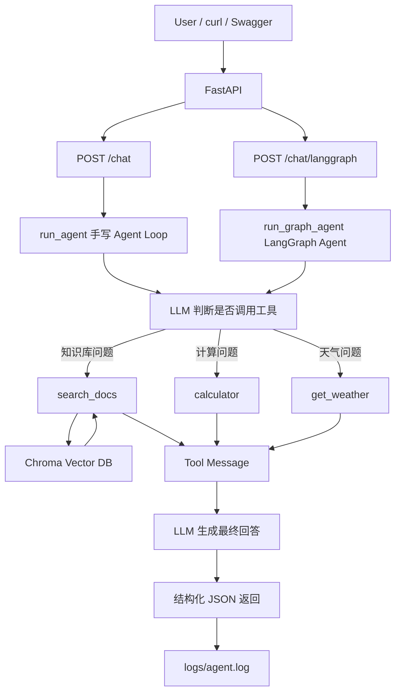

# Enterprise RAG Agent

一个基于 **RAG + Function Calling + FastAPI** 的企业知识库多工具 Agent 项目。

本项目从零实现了一个可调用本地知识库、计算器和天气工具的 Agent，并补充了结构化返回、工具调用记录、RAG 来源追踪、日志记录、chunk-level 检索评估、最小 rerank baseline 和 FastAPI 服务化能力。

当前提供两套 Agent API：

| 接口 | 实现方式 | 特点 |
|---|---|---|
| `POST /chat` | 手写 Agent Loop | 适合理解 Function Calling 底层流程 |
| `POST /chat/langgraph` | LangGraph Agent | 支持 checkpoint、session_id 有状态会话、多会话隔离 |

> 项目定位：面向 LLM 应用开发 / RAG 工程 / Agent 开发岗位的求职展示项目。

---

## 1. 项目简介

传统 RAG 通常是固定流程：

```text
用户问题 → 检索知识库 → LLM 生成回答
```

本项目将 RAG 检索能力封装成 Agent 工具，让模型根据用户问题自动决定是否需要调用工具：

```text
用户问题
  ↓
LLM 判断是否需要工具
  ↓
search_docs / calculator / get_weather
  ↓
工具结果返回给 LLM
  ↓
生成最终回答
```

当前支持的工具：

| 工具名 | 功能 |
|---|---|
| `search_docs` | 检索本地知识库 |
| `calculator` | 执行基础数学运算 |
| `get_weather` | 查询模拟天气 |

---

## 2. 技术栈

| 模块 | 技术 |
|---|---|
| LLM 调用 | LangChain `ChatOpenAI` |
| 模型 API | DeepSeek OpenAI-compatible API |
| Embedding | `BAAI/bge-m3` |
| 向量数据库 | Chroma |
| 文档切分 | `RecursiveCharacterTextSplitter` |
| Agent 实现 | 手写 Function Calling Agent Loop |
| LangGraph 学习版 | StateGraph / checkpoint / thread_id |
| 工具定义 | JSON Schema / Tool Calling |
| API 服务 | FastAPI |
| 请求校验 | Pydantic |
| 日志 | JSONL |
| 评估 | 自定义 eval 脚本 |

---

## 3. 系统架构



---

## 4. 核心功能

### 4.1 本地知识库 RAG

- 支持读取 `docs/` 目录下的 `.md` / `.txt` 文件
- 使用 `RecursiveCharacterTextSplitter` 切分文档
- 使用 `BAAI/bge-m3` 生成 embedding
- 使用 Chroma 存储和检索向量
- 为每个 chunk 写入 `source`、`chunk_id`、`chunk_index` metadata
- 检索结果返回 `source`、`chunk_id`、`chunk_index`、`content`

### 4.1.1 两阶段检索与最小 rerank baseline

`search_docs` 当前采用两阶段检索：

```text
用户 query
  ↓
Chroma 向量召回 top candidate_k
  ↓
基于 query 和 chunk 的词项重叠进行 rerank
  ↓
返回重排后的 top k chunk
```

实现方式：

- 第一阶段：用 Chroma `similarity_search` 多召回候选，`candidate_k = max(k * 3, 5)`。
- 第二阶段：使用一个轻量规则 rerank baseline，对 query 和 chunk 做词项匹配打分。
- 中文 query 会被拆成 2 字符窗口，英文 / 数字按词保留。
- 返回结果中包含 `rerank_score`，方便观察重排是否生效。

该 baseline 不是正式 reranker 模型，但能体现 RAG 中“先召回、再重排”的工程思路。当前评估中，加入 rerank baseline 后，Chunk Recall@3 从 **85.19%** 提升到 **96.30%**。

### 4.2 Function Calling Agent Loop

Agent 主流程：

```text
1. 用户输入问题
2. 模型判断是否需要调用工具
3. 程序执行工具
4. 工具结果写回 messages
5. 模型基于工具结果生成最终回答
```

### 4.3 结构化返回

`run_agent()` 返回：

```json
{
  "user_query": "帮我计算 23 乘以 19",
  "answer": "23 乘以 19 的结果是 437。",
  "tool_calls": [
    {
      "name": "calculator",
      "args": {
        "operation": "multiply",
        "a": 23,
        "b": 19
      },
      "result": {
        "result": 437
      }
    }
  ],
  "sources": [],
  "rounds": 2
}
```

### 4.4 日志记录

每次 Agent 执行结果会追加写入：

```text
logs/agent.log
```

日志格式为 JSONL，便于后续分析和评估。

### 4.5 Agent 与 RAG 评估

项目内置最小评估脚本：

```text
eval/questions.json
eval/run_eval.py
```

评估集中的每条样本包含用户问题、期望调用工具、期望命中的文档来源和期望命中的 chunk：

```json
{
  "id": "rag_chunk_001",
  "question": "RAG 中为什么要切分文档？",
  "expected_tools": ["search_docs"],
  "expected_sources": ["langchain_rag.md"],
  "expected_chunk_ids": [
    "langchain_rag.md::chunk_001",
    "langchain_rag.md::chunk_002"
  ]
}
```

当前评估四类指标：

1. **Tool Call Pass Rate**
   - 判断 Agent 是否调用了期望工具。
   - 例如知识库问题期望调用 `search_docs`，计算问题期望调用 `calculator`。

2. **Source Hit Rate**
   - 判断 RAG 检索结果是否命中了期望文档来源。

3. **Chunk Recall@1**
   - 判断排在第 1 位的 chunk 是否命中标注的 `expected_chunk_ids`。

4. **Chunk Recall@3**
   - 判断前 3 个 chunk 中覆盖了多少标注相关 chunk。

当前 rerank baseline 评估结果：

```text
Tool Call Pass Rate：100.00%
Source Hit Rate：100.00%
Chunk Recall@1：64.81%
Chunk Recall@3：96.30%
```

使用 `python eval/run_eval.py --compare-rerank` 可自动输出 rerank 前后对比：

```text
Chunk Recall@1：64.81% -> 64.81%（+0.00%）
Chunk Recall@3：85.19% -> 96.30%（+11.11%）
```

当前评估仍属于最小可用评估，后续可继续扩展为 MRR、真实 reranker 前后对比、答案正确性和引用一致性评估。

---

## 5. 项目结构

```text
.
├── app/
│   └── main.py                  # FastAPI 服务入口
├── docs/                        # 本地知识库文档
├── eval/
│   ├── questions.json           # 评估问题集
│   └── run_eval.py              # Agent 工具调用与 RAG source 命中评估脚本
├── logs/
│   └── agent.log                # Agent 执行日志
├── agent.py                     # 手写 Function Calling Agent Loop
├── config.py                    # 项目配置
├── models.py                    # LLM 和 Embedding 初始化
├── schemas.py                   # 工具 Schema
├── tools.py                     # 工具函数实现
├── vector_store.py              # 文档加载、切分、Chroma 向量库
├── RAG_Agent_demo.py            # 命令行交互入口
├── PROJECT_OVERVIEW.md          # 项目细节文档
├── TECH_NOTES.md                # 技术知识点文档
├── INTERVIEW_QA.md              # 面试问题整理
└── README.md
```

---

## 6. 快速开始

### 6.1 安装依赖

建议使用 Python 3.11。

```bash
python -m venv .venv
source .venv/bin/activate
pip install -r requirements.txt
```

如果你使用 conda，也可以：

```bash
conda create -n rag-agent python=3.11
conda activate rag-agent
pip install -r requirements.txt
```

---

### 6.2 环境变量

在项目根目录创建 `.env`：

```env
DEEPSEEK_API_KEY=你的 API Key
DEEPSEEK_BASE_URL=https://api.deepseek.com
DEEPSEEK_MODEL=deepseek-v4-flash
```

> 注意：不要把真实 API Key 提交到 GitHub。

---

### 6.3 命令行运行

```bash
python RAG_Agent_demo.py
```

示例问题：

```text
RAG 是什么？
帮我计算 23 乘以 19
上海今天天气怎么样？
请介绍一下 RAG，并帮我计算 12 加 8
```

---

### 6.4 启动 FastAPI 服务

```bash
uvicorn app.main:app --reload
```

健康检查：

```bash
curl http://127.0.0.1:8000/health
```

返回：

```json
{
  "status": "ok",
  "service": "rag-agent-api"
}
```

---

### 6.5 调用 `/chat`

```bash
curl -X POST http://127.0.0.1:8000/chat \
  -H "Content-Type: application/json" \
  -d '{"message": "帮我计算 23 乘以 19"}'
```

FastAPI Swagger 文档：

```text
http://127.0.0.1:8000/docs
```

---

### 6.6 调用 `/chat/langgraph`

`/chat/langgraph` 使用 LangGraph Agent，支持通过 `session_id` 保留多轮对话状态。

第一次请求：

```bash
curl -X POST http://127.0.0.1:8000/chat/langgraph \
  -H "Content-Type: application/json" \
  -d '{"message": "我叫小明", "session_id": "user-a"}'
```

第二次请求：

```bash
curl -X POST http://127.0.0.1:8000/chat/langgraph \
  -H "Content-Type: application/json" \
  -d '{"message": "我叫什么？", "session_id": "user-a"}'
```

预期：第二次可以回答你叫小明。

会话隔离测试：

```bash
curl -X POST http://127.0.0.1:8000/chat/langgraph \
  -H "Content-Type: application/json" \
  -d '{"message": "我叫什么？", "session_id": "user-b"}'
```

预期：`user-b` 不知道 `user-a` 的历史信息。

---

### 6.7 运行评估脚本

```bash
python eval/run_eval.py
```

输出示例：

```text
共加载 11 条评估问题
...
评估完成
总题数：11
工具调用通过数 Tool Call Pass Count：11
工具调用通过率 Tool Call Pass Rate：100.00%
来源命中数 Source Hit Count：11
来源命中率 Source Hit Rate：100.00%
RAG 评估题数：9
Chunk Recall@1：64.81%
Chunk Recall@3：96.30%
```

---

## 7. API 说明

### `GET /health`

健康检查接口。

响应：

```json
{
  "status": "ok",
  "service": "rag-agent-api"
}
```

---

### `POST /chat`

请求：

```json
{
  "message": "RAG 是什么？"
}
```

响应：

```json
{
  "user_query": "RAG 是什么？",
  "answer": "...",
  "tool_calls": [
    {
      "name": "search_docs",
      "args": {
        "query": "RAG 是什么？"
      },
      "result": [
        {
          "source": "rag_notes.md",
          "content": "..."
        }
      ]
    }
  ],
  "sources": ["rag_notes.md"],
  "rounds": 2
}
```

错误响应：

空问题：

```json
{
  "detail": "message 不能为空"
}
```

Agent 执行异常：

```json
{
  "detail": "Agent 执行失败：..."
}
```

---

### `POST /chat/langgraph`

LangGraph Agent 聊天接口。

请求：

```json
{
  "message": "我叫什么？",
  "session_id": "user-a"
}
```

字段说明：

| 字段 | 含义 |
|---|---|
| `message` | 用户问题 |
| `session_id` | API 层会话 ID，会映射为 LangGraph 的 `thread_id` |

响应：

```json
{
  "thread_id": "user-a",
  "answer": "你叫小明。",
  "tool_calls": [],
  "sources": [],
  "messages_count": 4
}
```

如果调用工具，响应中会包含 `tool_calls` 和 `sources`。

错误响应：

```json
{
  "detail": "message 不能为空"
}
```

或：

```json
{
  "detail": "session_id 不能为空"
}
```

---

## 8. 项目亮点

### 8.1 RAG 被封装为 Agent 工具

不是固定每次检索，而是让模型根据问题决定是否调用 `search_docs`。

### 8.2 支持多工具调用

例如：

```text
请介绍一下 RAG，并帮我计算 12 加 8
```

Agent 可以同时调用：

```text
search_docs + calculator
```

### 8.3 具备工程化基础

项目不仅能回答问题，还实现了：

- 结构化返回
- 工具调用 trace
- RAG 来源追踪
- 工具异常保护
- 最大轮数限制
- JSONL 日志
- 自动评估脚本
- FastAPI 服务化
- HTTP 请求校验和错误处理

### 8.4 可评估

通过 `eval/run_eval.py` 自动验证：

- Agent 是否调用了期望工具
- RAG 是否命中了期望文档来源
- top-k 检索结果是否命中了期望 chunk
- rerank baseline 是否改善检索排序

当前评估指标包括 Tool Call Pass Rate、Source Hit Rate、Chunk Recall@1 和 Chunk Recall@3，避免只靠人工测试。

### 8.5 LangGraph 有状态 Agent 学习版

项目中包含：

```text
LangGraph_learning/step2_agent_loop_graph.py
```

该文件用于学习如何把手写 Agent Loop 映射为 LangGraph：

```text
START → model → conditional edge
              ├── tools → model
              └── END
```

并进一步加入：

- `InMemorySaver` checkpoint
- `thread_id` 会话 ID
- 同一 thread_id 的历史记忆
- 不同 thread_id 的会话隔离
- LangGraph Agent 结构化返回
- 自定义 `GraphState`
- 自定义 reducer 累积 `tool_calls` 和 `sources`

当前 LangGraph 学习版返回：

```python
{
    "thread_id": "...",
    "answer": "...",
    "tool_calls": [...],
    "sources": [...],
    "messages_count": 6
}
```

并且已经通过 FastAPI 暴露为：

```text
POST /chat/langgraph
```

该接口把请求里的 `session_id` 映射为 LangGraph 的 `thread_id`，从而实现：

- 同一个 `session_id` 保留历史上下文
- 不同 `session_id` 之间状态隔离
- 工具调用记录和 RAG 来源可跨轮累积

---

### 8.6 手写 Agent 和 LangGraph Agent 对比

| 能力 | `/chat` 手写 Agent | `/chat/langgraph` LangGraph Agent |
|---|---|---|
| 工具调用 | 支持 | 支持 |
| RAG 来源 | 支持 | 支持 |
| 结构化返回 | 支持 | 支持 |
| 日志 | 支持 | 暂未单独写日志 |
| 流程表达 | Python loop / if-else | StateGraph / Node / Edge |
| 有状态会话 | 需要手动管理 | checkpoint + thread_id |
| 多会话隔离 | 需要手动实现 | 已支持 |
| 适合用途 | 理解底层原理 | 扩展复杂 Agent 工作流 |

---

## 9. 当前不足

当前项目仍是学习和求职展示阶段，存在以下不足：

1. 当前 rerank 只是基于词项重叠的 baseline，还没有接入真正的 reranker 模型
2. 评估已覆盖工具调用、source 命中和 chunk-level Recall@k，但还没有覆盖答案质量、引用一致性和 MRR 等更完整指标
3. 天气工具是模拟数据
4. 尚未 Docker 化
5. 尚未接入前端
6. LangGraph 已接入 FastAPI，但 checkpoint 目前仍是内存级 InMemorySaver，尚未持久化到数据库
7. 尚未接入 vLLM 本地模型部署

---

## 10. 后续优化计划

优先级从高到低：

1. 增加 RAG 答案质量评估和引用一致性评估
2. 扩展检索评估为 MRR，并记录 rerank 前后对比结果
3. 接入真正的 reranker 模型替换当前词项重叠 baseline
4. Docker 化部署
5. 将 LangGraph Agent 接入 FastAPI 主流程
6. 接入 vLLM 部署本地 Qwen 小模型
7. 增加前端页面
8. 接入真实天气 / 搜索 / 数据库工具

---

## 11. 面试讲解建议

可以用下面这段话介绍项目：

> 我实现了一个基于 RAG 和 Function Calling 的多工具 Agent。系统把本地知识库检索、计算器和天气查询封装成工具，模型会根据用户问题自动选择工具。工具执行后，结果会返回给模型生成最终答案。项目还做了工程化增强，包括结构化返回、工具调用记录、RAG 来源追踪、异常处理、JSONL 日志、最小工具调用、RAG source 命中、chunk-level Recall@k 评估和 rerank baseline，以及 FastAPI 服务化接口。同时我用 LangGraph 重构了 Agent Loop，新增 `/chat/langgraph` 接口，通过 checkpoint 和 session_id/thread_id 实现有状态多轮对话与多会话隔离。

重点可以展开讲：

1. RAG 流程：文档加载、切分、embedding、Chroma 检索
2. Agent Loop：模型 tool_calls、程序执行工具、工具结果写回 messages
3. 工程化：结构化返回、日志、评估、API
4. 下一步优化：真实 reranker、答案质量评估、vLLM、Docker
