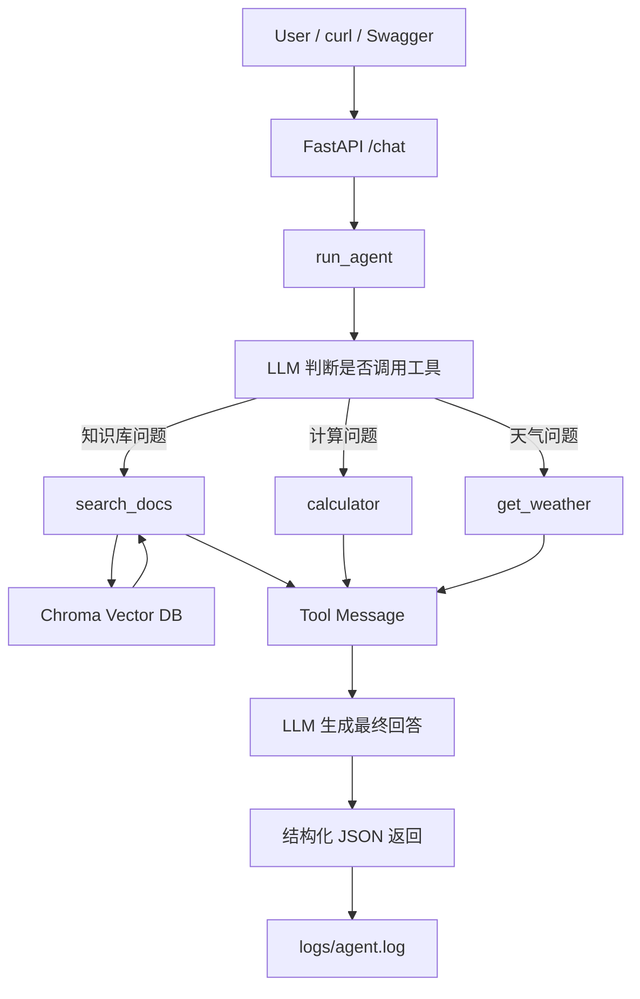

# Enterprise RAG Agent

一个基于 **RAG + Function Calling + FastAPI** 的企业知识库多工具 Agent 项目。

本项目从零实现了一个可调用本地知识库、计算器和天气工具的 Agent，并补充了结构化返回、工具调用记录、RAG 来源追踪、日志记录、最小评估脚本和 FastAPI 服务化能力。

> 项目定位：面向 LLM 应用开发 / RAG 工程 / Agent 开发岗位的求职展示项目。

---

## 1. 项目简介

传统 RAG 通常是固定流程：

```text
用户问题 → 检索知识库 → LLM 生成回答
```

本项目将 RAG 检索能力封装成 Agent 工具，让模型根据用户问题自动决定是否需要调用工具：

```text
用户问题
  ↓
LLM 判断是否需要工具
  ↓
search_docs / calculator / get_weather
  ↓
工具结果返回给 LLM
  ↓
生成最终回答
```

当前支持的工具：

| 工具名 | 功能 |
|---|---|
| `search_docs` | 检索本地知识库 |
| `calculator` | 执行基础数学运算 |
| `get_weather` | 查询模拟天气 |

---

## 2. 技术栈

| 模块 | 技术 |
|---|---|
| LLM 调用 | LangChain `ChatOpenAI` |
| 模型 API | DeepSeek OpenAI-compatible API |
| Embedding | `BAAI/bge-m3` |
| 向量数据库 | Chroma |
| 文档切分 | `RecursiveCharacterTextSplitter` |
| Agent 实现 | 手写 Function Calling Agent Loop |
| 工具定义 | JSON Schema / Tool Calling |
| API 服务 | FastAPI |
| 请求校验 | Pydantic |
| 日志 | JSONL |
| 评估 | 自定义 eval 脚本 |

---

## 3. 系统架构



---

## 4. 核心功能

### 4.1 本地知识库 RAG

- 支持读取 `docs/` 目录下的 `.md` / `.txt` 文件
- 使用 `RecursiveCharacterTextSplitter` 切分文档
- 使用 `BAAI/bge-m3` 生成 embedding
- 使用 Chroma 存储和检索向量
- 检索结果返回 `source` 和 `content`

### 4.2 Function Calling Agent Loop

Agent 主流程：

```text
1. 用户输入问题
2. 模型判断是否需要调用工具
3. 程序执行工具
4. 工具结果写回 messages
5. 模型基于工具结果生成最终回答
```

### 4.3 结构化返回

`run_agent()` 返回：

```json
{
  "user_query": "帮我计算 23 乘以 19",
  "answer": "23 乘以 19 的结果是 437。",
  "tool_calls": [
    {
      "name": "calculator",
      "args": {
        "operation": "multiply",
        "a": 23,
        "b": 19
      },
      "result": {
        "result": 437
      }
    }
  ],
  "sources": [],
  "rounds": 2
}
```

### 4.4 日志记录

每次 Agent 执行结果会追加写入：

```text
logs/agent.log
```

日志格式为 JSONL，便于后续分析和评估。

### 4.5 Agent 评估

项目内置最小评估脚本：

```text
eval/questions.json
eval/run_eval.py
```

当前评估目标：

```text
判断 Agent 是否调用了期望工具。
```

示例：

```json
{
  "id": "calc_001",
  "question": "帮我计算 23 乘以 19",
  "expected_tools": ["calculator"]
}
```

---

## 5. 项目结构

```text
.
├── app/
│   └── main.py                  # FastAPI 服务入口
├── docs/                        # 本地知识库文档
├── eval/
│   ├── questions.json           # 评估问题集
│   └── run_eval.py              # Agent 工具调用评估脚本
├── logs/
│   └── agent.log                # Agent 执行日志
├── agent.py                     # 手写 Function Calling Agent Loop
├── config.py                    # 项目配置
├── models.py                    # LLM 和 Embedding 初始化
├── schemas.py                   # 工具 Schema
├── tools.py                     # 工具函数实现
├── vector_store.py              # 文档加载、切分、Chroma 向量库
├── RAG_Agent_demo.py            # 命令行交互入口
├── PROJECT_OVERVIEW.md          # 项目细节文档
├── TECH_NOTES.md                # 技术知识点文档
├── INTERVIEW_QA.md              # 面试问题整理
└── README.md
```

---

## 6. 快速开始

### 6.1 环境变量

在项目根目录创建 `.env`：

```env
DEEPSEEK_API_KEY=你的 API Key
DEEPSEEK_BASE_URL=https://api.deepseek.com
DEEPSEEK_MODEL=deepseek-v4-flash
```

> 注意：不要把真实 API Key 提交到 GitHub。

---

### 6.2 命令行运行

```bash
python RAG_Agent_demo.py
```

示例问题：

```text
RAG 是什么？
帮我计算 23 乘以 19
上海今天天气怎么样？
请介绍一下 RAG，并帮我计算 12 加 8
```

---

### 6.3 启动 FastAPI 服务

```bash
uvicorn app.main:app --reload
```

健康检查：

```bash
curl http://127.0.0.1:8000/health
```

返回：

```json
{
  "status": "ok",
  "service": "rag-agent-api"
}
```

---

### 6.4 调用 `/chat`

```bash
curl -X POST http://127.0.0.1:8000/chat \
  -H "Content-Type: application/json" \
  -d '{"message": "帮我计算 23 乘以 19"}'
```

FastAPI Swagger 文档：

```text
http://127.0.0.1:8000/docs
```

---

### 6.5 运行评估脚本

```bash
python eval/run_eval.py
```

输出示例：

```text
共加载 4 条评估问题
...
评估完成
总题数：4
通过数：4
通过率：100.00%
```

---

## 7. API 说明

### `GET /health`

健康检查接口。

响应：

```json
{
  "status": "ok",
  "service": "rag-agent-api"
}
```

---

### `POST /chat`

请求：

```json
{
  "message": "RAG 是什么？"
}
```

响应：

```json
{
  "user_query": "RAG 是什么？",
  "answer": "...",
  "tool_calls": [
    {
      "name": "search_docs",
      "args": {
        "query": "RAG 是什么？"
      },
      "result": [
        {
          "source": "rag_notes.md",
          "content": "..."
        }
      ]
    }
  ],
  "sources": ["rag_notes.md"],
  "rounds": 2
}
```

错误响应：

空问题：

```json
{
  "detail": "message 不能为空"
}
```

Agent 执行异常：

```json
{
  "detail": "Agent 执行失败：..."
}
```

---

## 8. 项目亮点

### 8.1 RAG 被封装为 Agent 工具

不是固定每次检索，而是让模型根据问题决定是否调用 `search_docs`。

### 8.2 支持多工具调用

例如：

```text
请介绍一下 RAG，并帮我计算 12 加 8
```

Agent 可以同时调用：

```text
search_docs + calculator
```

### 8.3 具备工程化基础

项目不仅能回答问题，还实现了：

- 结构化返回
- 工具调用 trace
- RAG 来源追踪
- 工具异常保护
- 最大轮数限制
- JSONL 日志
- 自动评估脚本
- FastAPI 服务化
- HTTP 请求校验和错误处理

### 8.4 可评估

通过 `eval/run_eval.py` 自动验证 Agent 是否调用了期望工具，避免只靠人工测试。

---

## 9. 当前不足

当前项目仍是学习和求职展示阶段，存在以下不足：

1. RAG 还没有 reranker
2. 评估目前只覆盖工具调用，没有覆盖答案质量
3. 天气工具是模拟数据
4. 尚未 Docker 化
5. 尚未接入前端
6. 尚未实现 LangGraph 版本的工作流编排
7. 尚未接入 vLLM 本地模型部署

---

## 10. 后续优化计划

优先级从高到低：

1. 增加 RAG 答案质量评估
2. 增加 source 命中评估
3. 加入 reranker
4. Docker 化部署
5. 使用 LangGraph 重构 Agent Loop
6. 接入 vLLM 部署本地 Qwen 小模型
7. 增加前端页面
8. 接入真实天气 / 搜索 / 数据库工具

---

## 11. 面试讲解建议

可以用下面这段话介绍项目：

> 我实现了一个基于 RAG 和 Function Calling 的多工具 Agent。系统把本地知识库检索、计算器和天气查询封装成工具，模型会根据用户问题自动选择工具。工具执行后，结果会返回给模型生成最终答案。项目还做了工程化增强，包括结构化返回、工具调用记录、RAG 来源追踪、异常处理、JSONL 日志、最小工具调用评估，以及 FastAPI 服务化接口。

重点可以展开讲：

1. RAG 流程：文档加载、切分、embedding、Chroma 检索
2. Agent Loop：模型 tool_calls、程序执行工具、工具结果写回 messages
3. 工程化：结构化返回、日志、评估、API
4. 下一步优化：LangGraph、rerank、vLLM、Docker

